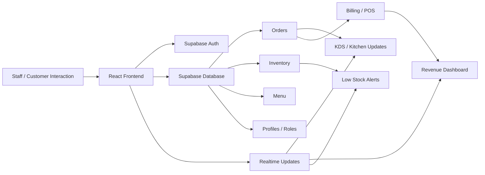

# KitChain

<div align="center">


</div>

<p align="center">
  <strong>KitChain</strong> is a real-time restaurant and cafe ERP platform built to automate the full operational flow of a food business — from table assignment to order management, kitchen coordination, inventory deduction, billing, and analytics.
</p>

<p align="center">
  <em>Everything happens in realtime.</em>
</p>

## Overview

Restaurants and cafes usually run with fragmented tools: separate systems for menu management, billing, kitchen communication, inventory counts, and staff access. KitChain brings these operations into a unified system so teams can move faster, reduce mistakes, and react instantly.

This project is designed around the reality of a high-traffic food service business where multiple staff roles need to stay in sync:

- waiters taking orders
- kitchen staff preparing dishes
- cashiers generating bills
- admins monitoring performance
- managers controlling inventory and reports

## Why this project matters

Manual restaurant operations often create:

- delays between order entry and kitchen preparation
- stock mismatches due to human error
- poor visibility into low-stock situations
- slow billing and payment tracking
- inconsistent role-based access control
- no single source of truth for daily operations

KitChain solves these problems by combining the entire workflow into one live operational system.

## Core automation workflows

KitChain is built around automation-first thinking:

1. Customer sits at a table
2. Waiter assigns the table and creates an order
3. Order is pushed to the kitchen queue in real time
4. Kitchen staff accepts and updates preparation status
5. As soon as food is ready, waiter is notified
6. Inventory is deducted automatically based on recipe mapping
7. Bill generation begins as orders are added
8. Payment is processed and reflected in analytics instantly
9. Admin dashboard updates live with revenue and stock visibility

## Features

### Restaurant operations

- table occupancy tracking
- dine-in / takeaway order support
- order queue and preparation flow
- kitchen display system (KDS)
- bill generation and payment tracking
- staff role-based permissions

### Inventory and menu control

- menu categories and menu items management
- recipe-to-ingredient mapping
- automatic stock deduction logic
- low-stock threshold alerts
- inventory adjustments and stock history

### Admin and analytics

- revenue dashboard
- active order monitoring
- top-selling item insights
- low inventory alerts
- operational reporting and logs

### Security and reliability

- Supabase authentication
- PostgreSQL Row Level Security (RLS)
- staff role restrictions
- audit-friendly data model
- realtime database syncing

## Tech stack

- Frontend: React + Vite
- Routing: React Router
- State/data layer: Supabase JS client
- Database: PostgreSQL via Supabase
- Authentication: Supabase Auth
- Real-time sync: Supabase Realtime
- Security rules: PostgreSQL RLS
- Styling: custom CSS and component-based UI

## System architecture



## App experience

KitChain is intended to support multiple restaurant roles in one shared ecosystem:

- Admin: full access to dashboard, stocks, orders, staff
- Waiter: table assignments, order creation, order status monitoring
- Kitchen Staff: KDS board, prep status updates, ready notifications
- Cashier: POS, billing, payment handling, inventory checks

## Screenshots and mockups

The project is currently structured around a working dashboard and role-based workflows. The following sections are intended as a visual preview space for the product.

### Dashboard preview

```text
+--------------------------------------------------------------+
| KitChain Dashboard                                            |
| Revenue  Active Orders  Low Stock  Top Selling                |
| ₹12,400    18             06         Pizza / Burger / Pasta   |
|--------------------------------------------------------------|
| Revenue Chart                  | Best Sellers                 |
| ▂▃▅▆▇█                        | 1. Pizza - 42 sold          |
|                                | 2. Burger - 36 sold         |
|                                | 3. Pasta - 29 sold          |
+--------------------------------------------------------------+
```

### Waiter flow mockup

```text
Table 04  Occupied  Assigned: Ravi
-----------------------------------
[Add Item] [Add Item] [Add Item]
Pizza x2
Burger x1
Cold Coffee x3

Total: ₹1,260
Status: Queued -> Preparing -> Ready
```

### Kitchen board mockup

```text
KDS BOARD
-----------------------------------
Order #1024 | Table 04 | Pizza x2
Status: Preparing | Accept / Ready

Order #1025 | Table 07 | Burger x1
Status: Queued | Accept / Ready

Order #1026 | Table 09 | Pasta x3
Status: Ready | Serve
```

### POS mockup

```text
CASHIER POS
Customer: Table 05
Items: 3
Subtotal: ₹990
GST: ₹118.80
Discount: ₹50
Total: ₹1,058.80
Payment: Card / UPI / Cash / Split
```

> Add real screenshots to this section later once the final UI is polished and ready for presentation.

## Repository structure

```bash
.
├── src/
│   ├── components/
│   ├── context/
│   ├── lib/
│   ├── pages/
│   ├── App.jsx
│   ├── main.jsx
│   └── index.css
├── public/
├── .env
├── .gitignore
├── index.html
├── package.json
├── schema.sql
├── vercel.json
├── README.md
├── Designing KitChain ERP Database Schema.md
└── dist/
```

## Database and Supabase setup

This project includes a production-oriented PostgreSQL schema for restaurant ERP work. The main database definition is in [schema.sql](schema.sql).

Database features include:

- `profiles` table extended from Supabase Auth users
- role-based access with admin, waiter, kitchen staff, and cashier
- `menu_categories` and `menu_items`
- `inventory_items` and `inventory_adjustments`
- `recipe_ingredients` for automatic stock deduction
- `restaurant_tables` for table state tracking
- `orders` and `order_items` for order workflows
- `kds_tickets` for kitchen operations
- billing and payment structures
- triggers, helper functions, and RLS policies

### Apply the schema

1. Create a new Supabase project.
2. Open the Supabase SQL editor.
3. Paste the contents of [schema.sql](schema.sql).
4. Run the script.
5. Verify that the tables, policies, and triggers are created successfully.

## Environment variables

Create a `.env` file in the root of the project:

```bash
VITE_SUPABASE_URL=your_supabase_project_url
VITE_SUPABASE_ANON_KEY=your_supabase_anon_key
```

The frontend connects to Supabase using the values in [src/lib/supabase.js](src/lib/supabase.js).

## Developer setup

### Prerequisites

- Node.js 18+ recommended
- npm or pnpm
- a Supabase project
- a modern browser

### Install dependencies

```bash
npm install
```

### Run locally

```bash
npm run dev
```

### Production build

```bash
npm run build
```

### Preview production build

```bash
npm run preview
```

### Lint

```bash
npm run lint
```

## Authentication and role model

The app uses Supabase Auth with a custom profile layer.

New users are created with a pending approval pattern by default, which is then validated through the database and role checks in the schema. This keeps the system secure while supporting a real restaurant staffing structure.

### Roles

- Admin: full access to all modules and controls
- Waiter: table and order workflows
- Kitchen Staff: KDS and preparation actions
- Cashier: POS and billing operations

## Automation and real-time logic

The project is designed around operational automation and live coordination:

- order to kitchen sync
- stock deduction from recipe mapping
- low-stock alert generation
- dashboard refresh on order and inventory change
- waiter notification when items are ready
- payment and sales updates in live analytics

This is the central reason the database and RLS model are built the way they are.

## Current status

KitChain is currently an MVP-style restaurant ERP foundation with a strong backend architecture and role-based UI structure. It is ready for extension into a production-grade system for real dining businesses.

## Roadmap

### Next milestones

- complete bill and invoice generation logic
- finalize payment status handling
- improve inventory deduction automation
- implement audit log visibility
- add notifications for low stock and ready orders
- build analytics reports by day, week, month, and year
- add restaurant-specific reporting and export features
- support mobile-friendly operations for staff

### Longer term ideas

- online ordering integration
- delivery order management
- GST/tax engine
- supplier management
- payroll and attendance tracking
- customer loyalty and promotions
- advanced forecasting and demand analytics

## Contributing

Contributions are welcome.

If you are improving any part of the system, please keep your work focused and document database or permission changes clearly. This project is best developed with a strong emphasis on:

- data integrity
- role security
- operational clarity
- real-time synchronization correctness
- restaurant workflow realism

### Suggested contribution flow

```bash
git checkout -b feature/my-improvement
npm install
npm run dev
# make changes
npm run build
```

## License

This project does not currently include a license file. If you plan to share or distribute it publicly, it is recommended to add an explicit license such as MIT.

## Final note

KitChain is not just a menu or billing app — it is an operational automation system for a restaurant business. The architecture, schema, and workflow are designed to model the real pace of a service environment where every second matters and every role needs to work in sync.

> The real goal is simple: reduce manual work, increase visibility, and make restaurant operations run as smoothly as possible in real time.

If you want, the next step can be to add:

1. a fully branded landing-style hero section with product slogan and CTA
2. a real architecture diagram rendered as a high-quality SVG/PNG asset
3. actual screenshot cards once UI screens are captured
4. a polished contributor guide with PR workflow and branch standards

### Author: Arjya Dey
